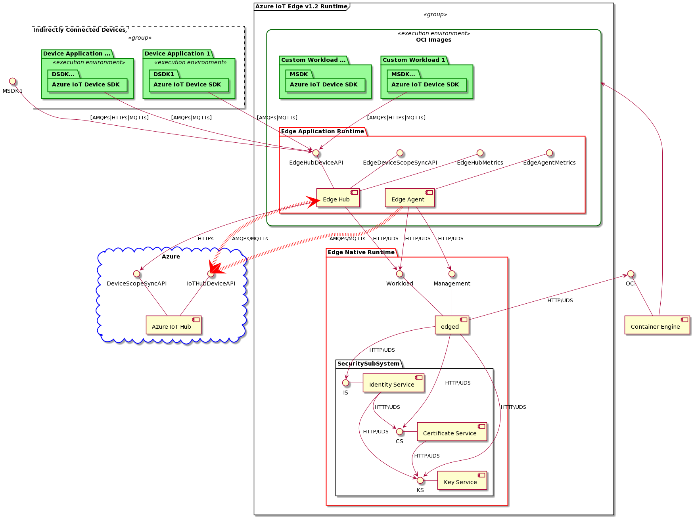

# Azure IoT Edge runtime components and customer workloads 

## Native Runtime

### Security Subsystem 
Security subsystem is in charge of all security operations, such as cryptographic operations, creation and distribution of certificates, and managing device and workloads [identity](https://docs.microsoft.com/en-us/azure/iot-hub/iot-hub-devguide-identity-registry). 
The security subsystem is composed of three main services: Identity, Certificate and Key services.  

The [installation](https://github.com/Azure/iot-identity-service/blob/main/docs/installation.md) of security subsystem [packages](https://github.com/Azure/iot-identity-service/blob/main/docs-dev/packaging.md) can be carried out on Linux via package manager.

The security subsystem services [configuration](https://github.com/Azure/iot-identity-service/blob/main/docs/configuration.md) is managed using the [_aziotctl_](https://github.com/Azure/iot-identity-service/blob/main/docs/aziotctl.md) tool. 

Most detailed documentation for security subsystem is contained in the [_iot-identity-service_](https://github.com/Azure/iot-identity-service/) repo. 

#### Identity Service 
The Identity Service manages device and workloads identity via the Identity Service [API](https://github.com/Azure/iot-identity-service/blob/main/docs/api/identity-service.md). 
Please check [Identity Service](https://github.com/Azure/iot-identity-service/blob/main/docs/index.md) documentation to configure the Identity Service for provisioning device identity and create workloads identities. 

#### Certificate Service 
The Certificate Service is in charge of creating, importing, and deleting certificates via the Certificate Service [API](https://github.com/Azure/iot-identity-service/blob/main/docs/api/certificates-service.md). 

#### Key Service 
The Key Service is in charge of managing keys and carry out cryptographic operations via the Key Service [API](https://github.com/Azure/iot-identity-service/blob/main/docs/api/keys-service.md).

The Key Service supports using a TPM or HSM. 

### Edgelet 
TODO:
1. What it is and what it does 
2. Interface, pointer to docs 
3. Most important clients and workflows 
4. Setup and Troubleshooting

### Edge Agent 
TODO:
1. What it is and what it does 
2. Interface, pointer to docs 
3. Most important clients and workflows 
4. Setup and Troubleshooting

## Application Runtime

### Edge Hub
TODO:
1. What it is and what it does 
2. Interface, pointer to docs 
3. Most important clients and workflows 
4. Setup and Troubleshooting

### Azure IoT Device SDK 
TODO:
1. What it is and what it does 
2. Interface, pointer to docs 
3. Most important clients and workflows 
4. Setup and Troubleshooting
