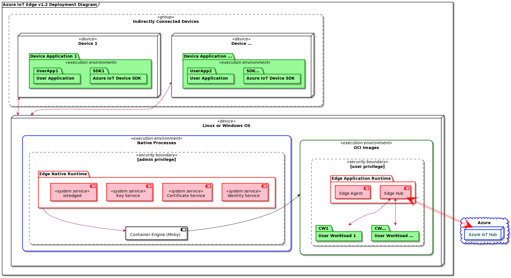

# Azure IoT Edge Deployment

The IoT Edge Runtime manages workloads on Edge devices and satellite devices connected to a Edge gateway. It allows workflows to be configured, deployed and monitored from the cloud, securely and at scale. 

## Physical Entities 

|:--:|
| Fig. 1 - Azure IoT Edge Deployment|

### Edge Runtime  
The Azure IoT Edge runtime is implemented as a collection of independent services that can be deployed to either Windows or Linux operating systems. Please see <LINK TO SUPORTED PLATFORM> for a full list of supported platforms. 
Some of Azure IoT Edge runtime services are native system services or processes. Other services are container images and run side by side with users' containerized workloads. 
All runtime components that are not container images are referred to as the _Edge Native Runtime_, all other are referred to as the Edge Application Runtime. 

All _native_ components require admin privilege. This is needed because the native runtime components need to access low level system resources such as <TODO: LINK> TPM or HSM, and interact with host-level components, such as an OCI-compatible container engine. 
 
The _application_ runtime components run in user context and only interact with a native runtime components via a well defined set of APIs. 

### User Workloads and Container Engine
All user workloads are container images. Azure IoT edge allows using any [OCI-compatible](https://opencontainers.org/) container engine. Azure IoT Edge is tested using [Moby](https://mobyproject.org/). Containers can communicate with the Edge rutnime using the [Azure IoT Device SDKs](https://docs.microsoft.com/en-us/azure/iot-hub/iot-hub-devguide-sdks).
  
Azure IoT Edge also works as a _gateway_ for devices that do not connect directly to Azure IoT Hub. Just like containers, device applications can use the [Azure IoT Device SDKs](https://docs.microsoft.com/en-us/azure/iot-hub/iot-hub-devguide-sdks) to communicate with the Edge runtime.
  
## Product acquisition
Azure IoT Edge is distributed as a collection of binaries via the [Edge release github repo](https://github.com/Azure/azure-iotedge). All code is generated from [Azure IoT Edge open-source project](https://github.com/lt72/iotedge) and the [Azure IoT Identity Service and related services](https://github.com/Azure/iot-identity-service) open source project. 
  
## Product installation and setup 
TBD
  
### Installation and setup validation and troubleshooting
TBD

  (iotedge --check)

## Next topics 
1. Component diagrams for all [Azure IoT Edge runtime components and workloads](./AzureIoTEdgeRuntime__components_and_workloads.md) 
2. Runtime [bootstrap sequence](./AzureIoTEdgeRuntime__bootstrap.md)
3. Customer [workloads interaction with Edge runtime](./AzureIoTEdgeRuntime__runtime_and_workloads_interactions.md)
4. Edge as a [gateway](./AzureIoTEdgeRuntime__gateway.md)
